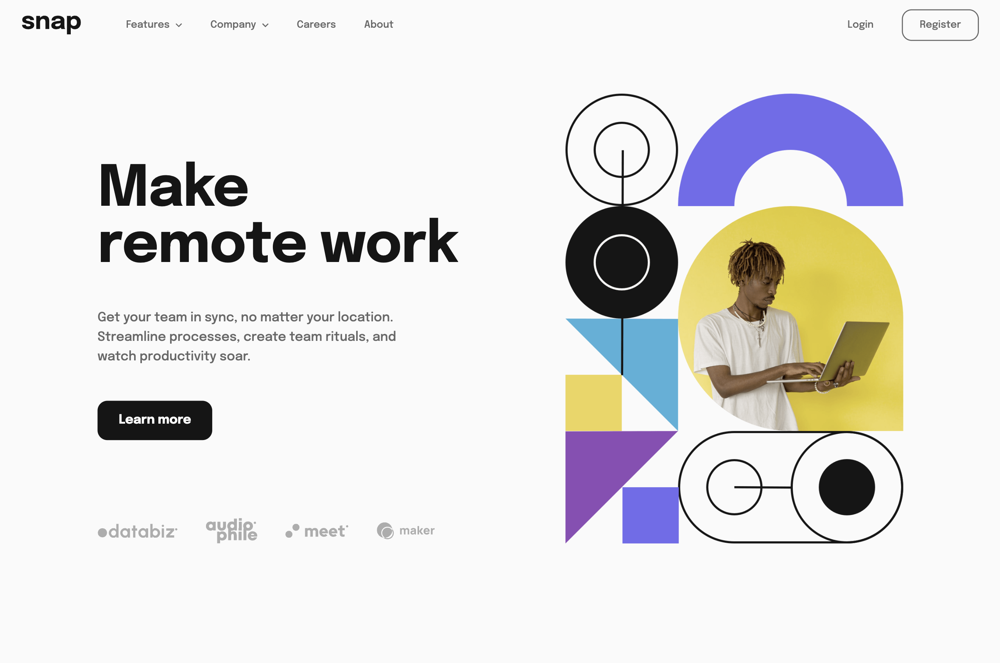

# Intro Section with Dropdown Navigation

## Table of contents

- [Overview](#overview)
  - [Screenshot](#screenshot)
  - [Links](#links)
- [My process](#my-process)
  - [Built with](#built-with)
- [Author](#author)

## Overview

### Screenshot

### Links

- Solution URL: [Solution URL](https://github.com/kisu-seo/intro_section_with_dropdown_navigation)
- Live Site URL: [Live URL](https://kisu-seo.github.io/intro_section_with_dropdown_navigation/)

## My process

### Built with

- **Semantic HTML5 Markup** — Page structure is built with semantic elements: `<header>`, `<nav>`, `<main>`, `<section>`, and `<ul>/<li>` for nested navigation lists. The navigation hierarchy explicitly mirrors the logical parent-child relationship between menu items and their dropdowns. No `
` is used where a semantic element is more appropriate.

- **Web Accessibility (ARIA)** — Full keyboard and screen reader support throughout:
  - `aria-expanded="false/true"` on each dropdown toggle button — dynamically updated by JavaScript to announce the open/closed state to screen readers.
  - `aria-haspopup="true"` on dropdown buttons to signal that a sub-menu will appear on activation.
  - `aria-controls` links each toggle button to its corresponding dropdown list by `id`, establishing a programmatic association.
  - `aria-hidden="true"` on all decorative images (arrow icons, hamburger icon) prevents redundant announcements.
  - `aria-label` on icon-only buttons (`hamburger`, `close`) provides a visible-less accessible name.
  - `aria-labelledby` on `<section class="hero">` points to the `<h1>` id, giving the landmark a descriptive name for screen reader navigation.
  - `role="list"` on `<ul>` elements re-asserts list semantics that may be stripped by some browsers when `list-style: none` is applied.

- **CSS Custom Properties (Design Tokens)** — All design values are declared in `:root` as the single source of truth, organized by concern:
  - **Color**: `--color-white`, `--color-black`, `--color-gray-950/500/400/200/50`, plus accent colors `--color-blue-400`, `--color-violet-500`, etc.
  - **Typography**: `--font-family`, `--font-weight-medium` (500), `--font-weight-bold` (700)
  - **Spacing (8px grid system)**: `--spacing-100` (8px) through `--spacing-900` (72px)
  - **Component tokens**: `--border-radius-sm` (8px), `--border-radius-md` (14px), `--transition-base` (0.25s ease)

- **Mobile-First Responsive Design (2 Breakpoints)** — Base styles target mobile (sidebar navigation). Two `min-width` media queries progressively enhance the layout:
  - **768px (Tablet)**: Sidebar width becomes `283px` fixed, header and hero content padding scales up.
  - **1024px (Desktop)**: Navigation switches from `position: fixed` sidebar to an inline horizontal `position: static` bar. Hero layout shifts from vertical stack to horizontal `flex-direction: row` with `order: -1` to visually place text left without changing HTML source order.

- **CSS Flexbox** — The primary layout mechanism used throughout. Key applications:
  - `.header`: `justify-content: space-between` to push logo and hamburger to opposing ends.
  - `.nav` (desktop): `flex: 1` + `justify-content: space-between` to distribute menu links and auth buttons across the full remaining header width.
  - `.hero`: `flex-direction: column` (mobile) → `row` (desktop) with `justify-content: space-between` to split content and image.
  - `.nav__auth`: `flex-direction: column` (mobile, full-width buttons) → `row` (desktop, inline buttons).

- **CSS Transition & Transform for UI Interactions** — All interactive state changes are handled with CSS rather than JS style mutations:
  - Mobile sidebar slides in via `transform: translateX(100%)` → `translateX(0)` toggled by adding `.nav--open` class.
  - Dropdown arrow icon flips 180° via `.nav__btn[aria-expanded="true"] .nav__arrow { transform: rotate(180deg); }` with a `transition`.
  - Overlay fades in via `opacity` + `visibility` transition — `visibility: hidden` (not `display: none`) ensures pointer events are blocked without Layout Shift.

- **Stacking Context (z-index Architecture)** — The layering is carefully designed to avoid Stacking Context traps:
  - `.overlay`: `z-index: 30` — dims the background behind the sidebar.
  - `.nav` (sidebar): `z-index: 50` — sits above the overlay.
  - `.header__hamburger`: `z-index: 100` — always on top to remain clickable.
  - `.header` intentionally has **no** `z-index` assigned to prevent creating a Stacking Context that would trap `.nav` below the overlay.

- **Responsive Image with `<picture>` (Art Direction)** — The hero image uses `<picture>` + `<source media="(min-width: 1024px)">` instead of a single ``. This serves a fundamentally different image composition (portrait crop for desktop, landscape for mobile) and ensures only one appropriately-sized image is downloaded per viewport, eliminating wasted bandwidth.

- **Vanilla JavaScript — Event Delegation Pattern** — Instead of attaching individual `click` listeners to each dropdown button, a single listener is registered on the parent `.nav__list`. The handler uses `event.target.closest()` to identify whether a dropdown button was clicked. This reduces memory usage and automatically handles any dynamically added menu items in the future.

- **Vanilla JavaScript — Debounce on Resize** — A `setTimeout` / `clearTimeout` debounce is applied to the `window resize` event. During resizing, a `resize-animation-stopper` class is added to `body`, which uses `!important` to disable all `transition` and `animation` properties globally, preventing the sidebar's slide animation from firing as a visual glitch when crossing the `1024px` breakpoint.

- **`window.matchMedia` for JS/CSS Sync** — Rather than reading `window.innerWidth` inside the resize handler (which fires hundreds of times per second), `window.matchMedia('(min-width: 1024px)')` is used with a `change` event listener. This fires exactly once when the breakpoint threshold is crossed, and keeps the JS breakpoint constant (`BREAKPOINT_DESKTOP = 1024`) in sync with the CSS media query.

- **Keyboard Accessibility (ESC Key)** — A `keydown` event listener on `document` closes all open dropdowns and the mobile sidebar when the `Escape` key is pressed, following ARIA Authoring Practices Guide patterns for dismissible overlays.

- **Google Fonts via `<link rel="preconnect">`** — The `Epilogue` font (weights 500, 700) is loaded from Google Fonts. Two `<link rel="preconnect">` tags pre-warm the DNS + TCP + TLS handshake to `fonts.googleapis.com` and `fonts.gstatic.com` before the font request is made, reducing perceived load latency.

- **JSDoc Documentation** — All JavaScript functions and constants are annotated with JSDoc block comments (`/** ... */`) specifying `@param`, `@returns`, `@type`, and `@constant` tags, along with `[영향도]` (impact) notes explaining what breaks if a constant value is changed. This enables IDE IntelliSense hover hints and serves as inline API documentation.

## Author

- Website - [Kisu Seo](https://github.com/kisu-seo)
- Frontend Mentor - [@kisu-seo](https://www.frontendmentor.io/profile/kisu-seo)
